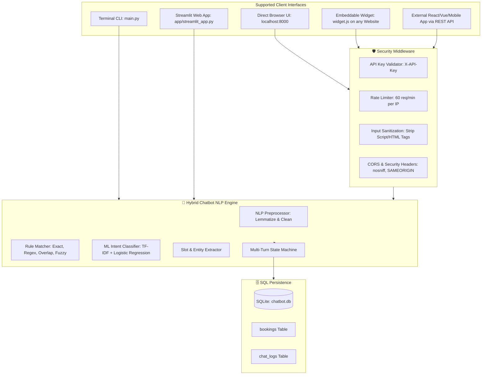

# 🤖 Rule-Based & NLP Hybrid Chatbot with SQL Storage & Secure Web API

A complete, production-ready chatbot combining **Rule Matching**, **NLP Tokenization & Lemmatization**, **Fuzzy Typo Tolerance**, **TF-IDF ML Intent Classification**, **Multi-Turn Slot Filling**, **SQLite Persistence**, and a **Secure FastAPI REST Backend** with an **Embeddable Web Widget**.

---

## 🌟 Architecture Overview



---

## 🛡️ Security Features

1. **API Key Authentication (`src/security.py`)**:
   - Master key configured via `CHATBOT_API_KEY` (default: `chatbot-secret-key-2026`).
   - Configurable enforcement via `ENFORCE_API_KEY=true`.
2. **Anti-Spam & DDoS Rate Limiting**:
   - Sliding window rate limiter enforcing 60 requests/minute per client IP.
3. **XSS & Code Injection Shield**:
   - Automatic stripping of `<script>` tags, HTML attributes, and character escaping before text processing or SQL insertion.
4. **Parameterized SQL Queries**:
   - 100% parameter-bound queries preventing SQL Injection.
5. **CORS & Security Headers**:
   - Safe cross-origin access and browser security headers (`X-Content-Type-Options`, `X-Frame-Options`, `X-XSS-Protection`).

---

## 🌐 Web App Integration

### Option 1: 1-Line Embeddable Chat Widget (`widget.js`)
Add this single line anywhere inside the `<body>` of your React, Vue, or static HTML website:

```html
<script src="http://localhost:8000/static/widget.js"></script>
```

*(Optional config attributes)*:
```html
<script 
  src="http://localhost:8000/static/widget.js" 
  data-api-url="http://localhost:8000" 
  data-api-key="chatbot-secret-key-2026">
</script>
```

### Option 2: REST API Call (`POST /api/chat`)
Integrate into any custom frontend framework (React, Vue, Next.js, Flutter, etc.):

```javascript
const response = await fetch("http://localhost:8000/api/chat", {
  method: "POST",
  headers: {
    "Content-Type": "application/json",
    "X-API-Key": "chatbot-secret-key-2026" // optional if enforcement enabled
  },
  body: JSON.stringify({
    message: "Book a table for 4 tomorrow at 7pm",
    session_id: "user_session_123"
  })
});

const data = await response.json();
console.log(data.response); // Bot message
console.log(data.intent);   // "book_appointment"
console.log(data.slots);    // { party_size: 4, date: "tomorrow", time: "7:00 PM" }
```

---

## 🚀 How to Run & Test

### 1. Test in Browser (FastAPI Web Client & Swagger UI)
Start the REST API server:
```bash
uvicorn app.api:app --host 127.0.0.1 --port 8000 --reload
```
Open in your browser:
- **Web Chat Application**: [http://127.0.0.1:8000](http://127.0.0.1:8000)
- **Interactive Swagger API Docs**: [http://127.0.0.1:8000/docs](http://127.0.0.1:8000/docs)

### 2. Run Streamlit UI (with SQL Analytics Dashboard)
```bash
streamlit run app/streamlit_app.py
```

### 3. Run Terminal CLI
```bash
python main.py
```

### 4. Run Automated Test Suite
```bash
pytest
```
*(All 22 unit tests covering NLP preprocessing, rule engine, ML classifier, SQLite storage, and secure REST endpoints).*
